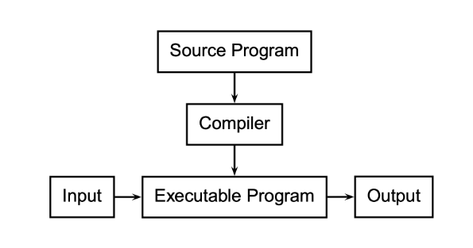
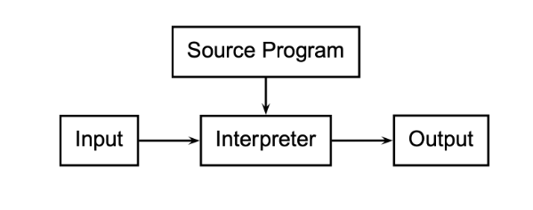
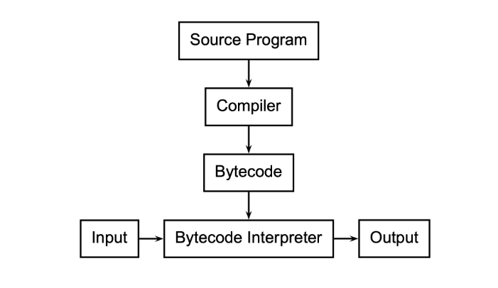
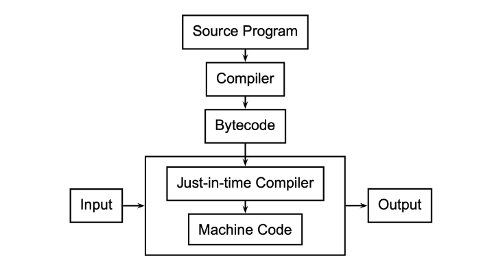

# Resum Final

Aquest resum es basa en les transparències de l'assignatura.

## Compiladors

Un **compilador** és un programa que tradueix programes escrits en un *LP* d'alt nivell a codi màquina (o, en general, a codi de baix nivell).



---

## Intèrprets

Un **intèrpret** és un programa que executa directament instruccions escrites en un *LP*.



---

## Interpèts de *bycode*

Variant entre els compiladors i els intèrprets.

- El ***bytecode*** és un codi intermedi més abstracte que el codi màquina.
- Augmenta la portabilitat i seguretat i facilita la interpretació.
- Una **màquina virtual** interpreta programes en *bytecode*.



---

## Compiladors *Just-in-time*

La compilació ***just-in-time*** compila fragments del programa durant la seva execució.

Un analitzador inspecciona el codi executat per veure quan val la pena compilar-lo.



---

## Preprocessadors

Un **preprocessador** prepara el codi font d'un programa abans que el compilador el vegi.

- Expansió de *macros*
- Inclusió de fitxers
- Compilació condicional
- Extensions de llenguatge

---

## Sintaxi

La **sintaxi** d'un llenguatge de programació és el conjunt de regles que defineixen les combinacions de símbols que es consideren construccions correctament estructurades. Sovint s'especifica la sintaxi utilitzant una **gramàtica lliure de context** (*context-free grammar*).

Els elements més bàsics ("paraules") s'especifiquen a través d'**expressions regulars**. Aquí podem veure una sintaxi definida en *antlr*

```antlr4
expr → NUM
     | '(' expr ')'
     | expr '+' expr
     | expr '-' expr
     | expr '*' expr
     | expr '/' expr
NUM  → [0-9]+ ( '.' [0-9]+ )
```

---

## Semàntica

La **semàntica** d'un *LP* descriu què significa un programa ben construït. A vegades, les construccions sintàcticament correctes poden ser semànticament incorrectes.

> ```java
> class Foo {
>     int bar(int x) { return Foo; }
> }
> ```
> 
> Això és sintàcticament correcte en Java, però sense sentit (semàntica).

Hi ha bàsicament dues maneres d'especificar formalment la semàntica:

- **Semàntica operacional:** defineix una màquina virtual i com l'execució del programa canvia l'estat de la màquina.

- **Semàntica denotacional:** mostra com construir una funció que representa el comportament del programa (és a dir, una transformació d'entrades a sortides) a partir de les construccions del *LP*.

La majoria de definicions de semàntica per a *LPs* utilitzen una semàntica operacional descrita informalment en llenguatge natural.

---

## Flux de compilació

**Etapes:**

- ***Front end*:**
  - **Preprocessador**
  - L'**analitzador lèxic** (**escàner**) agrupa els caràcters en "paraules" (*tokens*) i elimina blancs i comentaris.
  - L'**analitzador sintàctic** (**parser**) construeix un **arbre de sintaxi abstracta** (***AST***) a partir de la seqüència de *tokens* i les regles sintàctiques.
  - L'**analitzador semàntic** recorre l'*AST* i:
    - crea la **taula de símbols**,
    - assigna memòria a les variables,
    - comprova errors de tipus,
    - resol ambigüitats.
- ***Middle end*** :arrow_right: tradueix el programa a **codi de tres adreces** (ensamblador idealitzat amb infinitat de registres).
  - analitzador de codi intermedi
  - optimitzador de codi intermedi
- ***Back end*** :arrow_right: tradueix i optimitza el codi de tres adreces a l'arquitectura desitjada
  - generador de codi específic
  - optimitzador de codi específic

---

## Eines

Per construir un compilador no es parteix de zero. Hi ha moltes eines que donen suport:

- **ANTLR**: donades les especificacions lèxiques i sintàctiques del *LP*, construeix automàticament **l’escàner**, **l’analitzador** i **l'AST**.

- **LLVM**: ofereix una col·lecció d'eines modulars reutilitzables pels backends dels compiladors.
